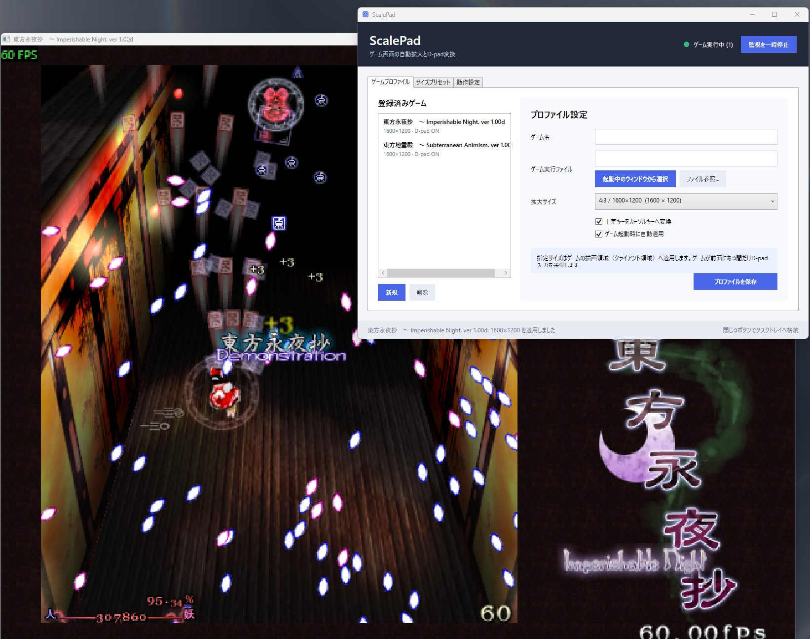

# TouhouScaleChanger

## 東方原作を遊ぶときに自分の好きなウィンドウサイズにしたい！というときのためのツールです

東方原作などのウィンドウサイズが固定されるゲーム用の拡大補助ツールです。
- 固定サイズのゲームウィンドウを見やすい大きさへ自動拡大
- Xboxコントローラーの十字キー入力を東方原作が受け取れるようにカーソルキー入力へ変換。

## ダウンロード

- [TouhouScaleChanger v0.3.0 / Windows x64 zip](https://github.com/noriben327/TouhouScaleChanger/releases/download/v0.3.0/TouhouScaleChanger-v0.3.0-win-x64.zip)

zipを展開して、`TouhouScaleChanger.exe` を起動してください。

## できること

- 固定サイズゲームウィンドウを指定したクライアントサイズへ自動拡大
- 4:3 / 16:9の拡大プリセットを内蔵
- ユーザー定義サイズの追加・削除
- Xboxコントローラーの十字キーをカーソルキーへ変換
- ゲーム名・拡大サイズ・D-pad変換ON/OFFをプロファイルとして保存
- 対象ゲームの起動を検出して、自動で拡大とD-pad変換を開始
- 対象ゲームが終了したら処理を停止
- 「タスクトレイに常駐させる」ボタンでタスクトレイへ格納

## 想定用途

- 東方原作をちょうどいい大きさの画面で遊びたい
- Xboxコントローラーの十字キーを使いたい
- ゲームごとにウィンドウサイズと入力設定を覚えさせたい

## 使い方

1. ゲームを起動。
2. TouhouScaleChangerで「新規」→「起動中のウィンドウから選択」を押し、対象ゲームを選択。
3. 拡大サイズと「Xboxコントローラーの十字キーをカーソルキーへ変換」のON/OFFを選ぶ。
4. 「プロファイルを保存」を押す。
5. 以後、TouhouScaleChangerを起動したまま対象ゲームを起動すると、自動で設定が適用される。

`.exe` ファイルを直接参照して登録することもできます。

常駐させたい場合は、画面上部の「タスクトレイに常駐させる」ボタンを押してください。

## 配布形態

TouhouScaleChangerはzip配布を想定したポータブルアプリです。

設定は `TouhouScaleChanger.exe` と同じフォルダの `TouhouScaleChanger.settings.json` に保存されます。
アンインストールするときは、展開したTouhouScaleChangerフォルダを削除してください。

## ライセンス

ソースコードはMIT Licenseで公開しています。

このリポジトリ内の東方Projectゲーム画面を含むスクリーンショットは、動作例を示すためのものであり、MIT Licenseの対象外です。
東方Projectおよび各作品の権利は、それぞれの権利者に帰属します。
TouhouScaleChangerは東方Project公式ツールではありません。

## 製作
Codexを使用して製作しました。
